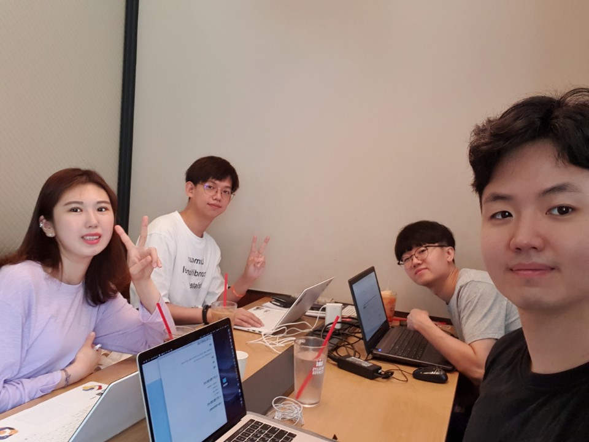

# 하이파이브 0825 회의

[TOC]

## 1. 진행 사항 공유 

- 퍼블리싱 기본 틀은 완료됨
- 디자인 많이 손봐야함
- css 손보기 vuetify 안쓰기
  - [Online tutorials](https://www.youtube.com/channel/UCbwXnUipZsLfUckBPsC7Jog)

### 퍼블리싱 완료 여부

- header
  - 뉴스 
    - 공지사항
    - 이벤트
  - 이용 방법(가이드)
  - 명예의 전당
    - 지역별,
    - 나이별
    - 직업별
    - 테마별
  - 커뮤니티
    - 자유게시판

- Main
- 이용 방법
- 회사 소개
- 팀원 소개
- footer
  - contact us
  - copyright
  - weather

### 추가 해야할 것

- 헤더 이벤트 hover 시 하위매뉴 보이도록 만들기
- 메인페이지 디자인 수정
- howto 디자인 수정
- team 디자인 수정
- member 구현 틀 짜는거 완료하기

## 2. 각자 공부한거 공유

### 동관

- 파이어베이스 공부중 - 인증, 베포, 실시간 데이터 관리 공부중, 소셜 로그인 공부중
- Front-end 공부중 - online tutorials 보면서 공부

> TODO
>
> 파이어베이스 개발
>
> 게시판 백엔드

### 길준

- 뷰 관련 강의 듣는중 - 캡틴 판교

> TODO
>
> 다음 지도 API 개발

### 현우

- Pwa 강의
- firebase 공부

> TODO
>
> 카메라 기능
>
> PWA

### 채원

- online tutorials 보면서 따라해보기
- 웹 적용시켜보기

> TODO
>
> 게시판 프론트엔드

## 3. 단기 개발 방향 논의

- 파이어베이스 시작해야할듯 - 동관
  - 아마존서비스? 파이어베이스?
- pwa 공부하기 - 현우
  - [관련 링크](https://www.youtube.com/watch?v=4XT23X0Fjfk&list=PL4cUxeGkcC9gTxqJBcDmoi5Q2pzDusSL7)
- 큐알코드 생성? - 
  - [큐알코드 생성기](https://www.qr-code-generator.com/a1/?ut_source=google_c&ut_medium=cpc&ut_campaign=allesprachen_foreign_terms&ut_content=allesprachen_foreign_terms_adgroups_other&ut_term=%ED%81%90%EC%95%8C%20%EC%BD%94%EB%93%9C%20%EB%A7%8C%EB%93%A4%EA%B8%B0_e&gclid=EAIaIQobChMI--_Zkpyd5AIVE66WCh0LKAqIEAAYASAAEgLt0PD_BwE)
- 카메라 기능 - 현우
  - 현우가 해본대
- 지도 - 길준
  - 다음지도
- crud - 프론트(채원), 백(동관)
  - 자유게시판
  - 공지사항
  - 문의게시판
  - 챗봇
- 성취감을 줄 수 있도록 하는 방법?
  - 레벨에 따른 개인 코스 알려주기. 참여 유도

## 4. 장기 개발 방향 논의

- 홍보 (마케팅)
  - 가게 설득
  - 인스타, 페이스북
  - 지자체 관광
  - 공모전
  - c.lab
- 인수 제안
- 루트짜기
  - 참여 유도
  - 알고리즘 정교하게 짜기 - 성향에 따른 추천 알고리즘
  - AI

### 회의 사진

